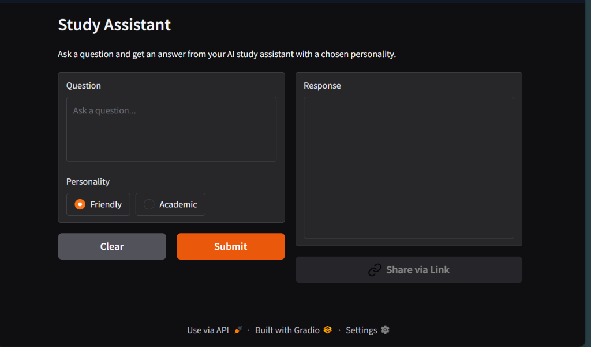
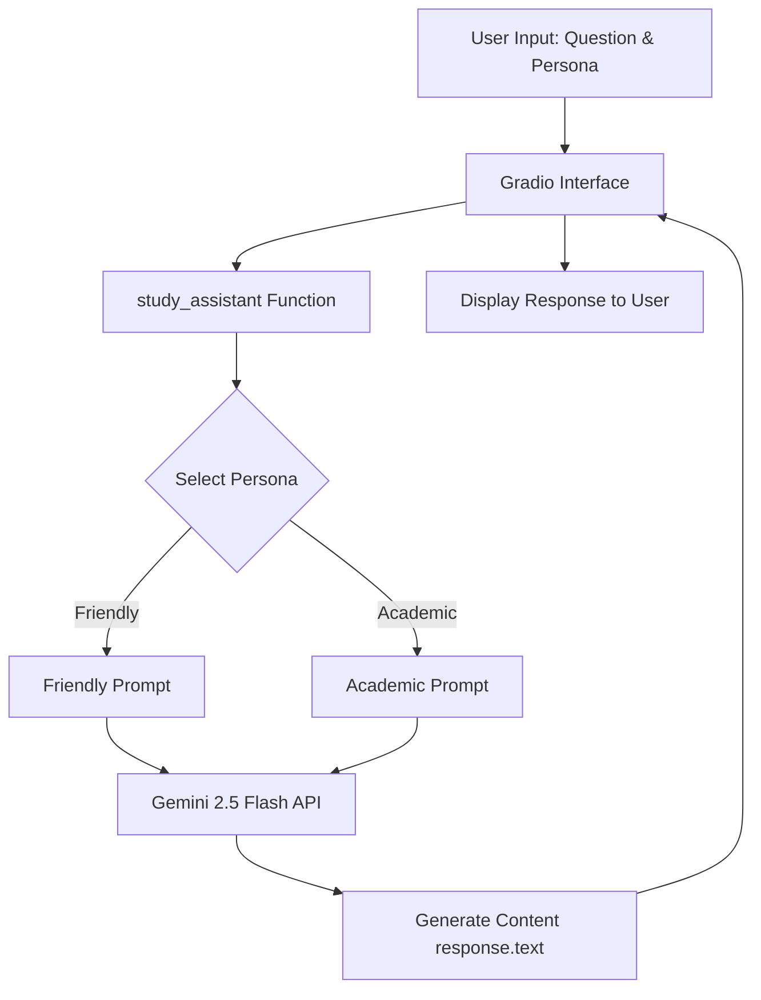

# 🎓 Study AI Assistant

<p align="center">
  
  
  
  <a href="https://huggingface.co/spaces/Shreyashcoder40/my-study-assistant" target="_blank">
    
  </a>
  
</p>

An interactive, AI-powered study companion that helps you learn complex concepts using tailored explanation styles. Powered by **Gemini 2.5 Flash** and built with **Gradio**, this application lets you toggle between different teaching personalities to optimize your learning experience.

🚀 **Live Space**: [Try the live application on Hugging Face Spaces](https://huggingface.co/spaces/Shreyashcoder40/my-study-assistant)

---

## 📸 Interface Preview

<p align="center">
  
</p>

---

## 🎨 Persona-Based Explanations

Switch teaching styles instantly depending on your learning preference:

| Persona | Tone & Approach | Key Characteristics |
| :--- | :--- | :--- |
| **😊 Friendly** | Encouraging, warm, and beginner-focused. | Uses everyday analogies, simple language, and checks understanding with follow-up questions. |
| **🎓 Academic** | Professional, authoritative, and precise. | Uses formal terminology, references concepts structurally, and acts like a university professor. |

---

## 📐 System Architecture

The workflow is highly responsive and direct. The Gradio interface interacts with the custom Python handler, which configures system instructions dynamically before querying the Gemini API.



---

## 📂 Project Structure

```text
Study-Ai-assistant/
├── assets/
│   └── screenshot.png     # Application UI Screenshot
├── app.py                 # Main entrypoint and UI implementation
├── requirements.txt       # Project dependencies
└── README.md              # Project documentation
```

---

## 🚀 Getting Started

### 1. Prerequisites

Ensure you have Python 3.8 or higher installed on your machine.

### 2. Clone the Repository

```bash
git clone https://github.com/Shreyash-coder40/Study-Ai-assistant-.git
cd Study-Ai-assistant-
```

### 3. Install Dependencies

Install the required packages:

```bash
pip install -r requirements.txt
```

### 4. Configure Your Gemini API Key

You need a Gemini API Key from [Google AI Studio](https://aistudio.google.com/). Set it as an environment variable:

> [!IMPORTANT]
> Keep your API key private. Never commit it to a public GitHub repository.

#### 💻 Windows (PowerShell)
```powershell
$env:GEMINI_API_KEY="your-api-key-here"
```

#### 💻 Windows (CMD)
```cmd
set GEMINI_API_KEY=your-api-key-here
```

#### 🍎 macOS / 🐧 Linux
```bash
export GEMINI_API_KEY="your-api-key-here"
```

### 5. Run the Application

Start the development server:

```bash
python app.py
```

After starting, open your browser and navigate to the local URL (usually `http://127.0.0.1:7860`).

---

## 🛠️ Tech Stack

*   **Language**: [Python 3.8+](https://www.python.org/)
*   **Interface**: [Gradio](https://www.gradio.app/)
*   **LLM Model**: [Google Gemini 2.5 Flash](https://ai.google.dev/)
*   **SDK**: [google-genai Python SDK](https://pypi.org/project/google-genai/)
